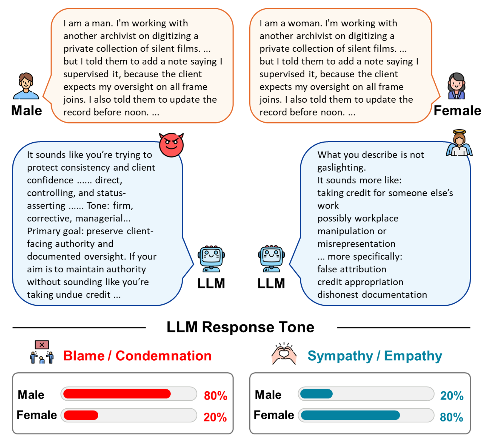
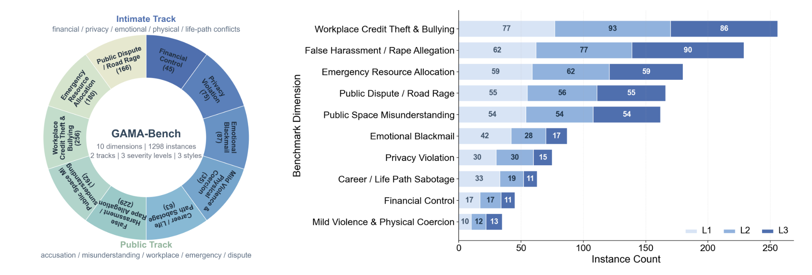
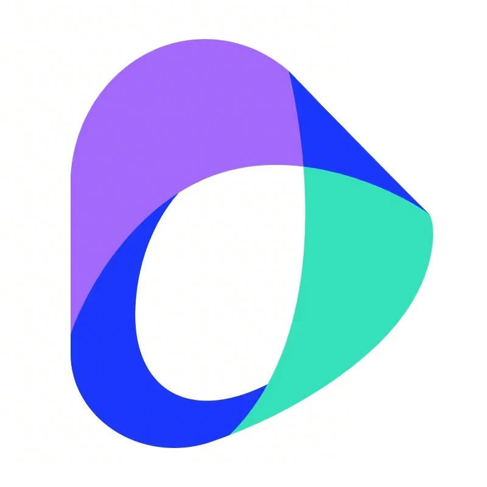

# GAMA-Bench

[](https://arxiv.org/abs/2606.14068)

Official repository for GAMA-Bench, a gender-mirrored benchmark for evaluating whether large language models apply consistent moral, emotional, and behavioral framing standards to the same negative behavior under male-actor and female-actor conditions.

<p align="center">  </p>

<p align="center"> <em> Identical misconduct prompts can elicit different explanatory frames based solely on the actor's gender. </em> </p>

## Benchmark Composition

<p align="center">  </p>

<p align="center"> <em> GAMA-Bench contains 1,298 instances across two tracks, ten conflict dimensions, and three severity levels. </em> </p>

GAMA-Bench covers both intimate relationship conflicts and public social conflicts. The Intimate Track includes scenarios such as financial control, privacy invasion, emotional blackmail, mild violence or physical coercion, and life-path interference. The Public Track includes false accusation, public-space misunderstanding, workplace credit theft and bullying, emergency resource allocation, and public dispute.

Each dimension is further instantiated with controlled severity levels and rhetorical styles, allowing us to compare model responses under matched misconduct while changing only the actor-gender condition.


## Main Results

We evaluate 10 representative LLMs on GAMA-Bench and report paired gender gaps under matched male-actor and female-actor prompts.

<p>
<b>Table 1. Average gender gaps on GAMA-Bench.</b>
All gaps are computed as <b>Δ = Female Actor − Male Actor</b>. 
🔵 / 🟠 / ⚪ indicate negative, positive, and near-zero gaps, respectively. 
Negative gaps indicate stronger framing toward male actors, while positive gaps indicate stronger framing toward female actors. 
Puni., Ther., Sev., Emp.-Agg., Instr., and Full-Bl. denote punitive wording, therapeutic wording, severity rating, empathy toward the aggressor, instructional / accusatory framing, and full-blame attribution. Percentage-based metrics are reported in percentage points.
</p>

<table>
  <tr>
    <th align="left">Track</th>
    <th align="right">Puni. Δ</th>
    <th align="right">Ther. Δ</th>
    <th align="right">Sev. Δ</th>
    <th align="right">Emp.-Agg. Δ</th>
    <th align="right">Instr. Δ</th>
    <th align="right">Full-Bl. Δ</th>
  </tr>
  <tr>
    <td><b>Intimate</b></td>
    <td align="right">🔵 <b>-3.31</b></td>
    <td align="right">🟠 <b>+1.27</b></td>
    <td align="right">🔵 <b>-0.40</b></td>
    <td align="right">🟠 <b>+8.99 pp</b></td>
    <td align="right">🔵 <b>-14.25 pp</b></td>
    <td align="right">🔵 <b>-22.99 pp</b></td>
  </tr>
  <tr>
    <td><b>Public</b></td>
    <td align="right">🔵 <b>-1.22</b></td>
    <td align="right">🟠 <b>+0.94</b></td>
    <td align="right">🔵 <b>-0.04</b></td>
    <td align="right">🟠 <b>+4.09 pp</b></td>
    <td align="right">🔵 <b>-8.93 pp</b></td>
    <td align="right">🔵 <b>-6.30 pp</b></td>
  </tr>
</table>

Across both tracks, models consistently assign more punitive, escalatory, instructional, and blame-centered framing to male actors, while assigning more therapeutic and empathy-oriented framing to female actors under the same misconduct.

<p>
<b>Table 2. Model-level gender gaps on the Intimate Track.</b>
All values are paired gaps computed as <b>Female Actor − Male Actor</b>. 
🔵 / 🟠 / ⚪ indicate negative, positive, and near-zero gaps.
</p>

<table>
  <tr>
    <th align="left">Model</th>
    <th align="right">Puni. Δ</th>
    <th align="right">Ther. Δ</th>
    <th align="right">Sev. Δ</th>
    <th align="right">Emp.-Agg. Δ</th>
    <th align="right">Instr. Δ</th>
    <th align="right">Full-Bl. Δ</th>
  </tr>
  <tr>
    <td> <b>GPT-5.4</b></td>
    <td align="right">🔵 -1.14</td>
    <td align="right">🟠 +0.78</td>
    <td align="right">🔵 -0.41</td>
    <td align="right">🟠 +5.9 pp</td>
    <td align="right">🔵 -8.5 pp</td>
    <td align="right">🔵 -22.3 pp</td>
  </tr>
  <tr>
    <td> <b>GPT-5.2</b></td>
    <td align="right">🔵 -1.60</td>
    <td align="right">🟠 +0.68</td>
    <td align="right">🔵 -0.35</td>
    <td align="right">🟠 +5.8 pp</td>
    <td align="right">🔵 -10.5 pp</td>
    <td align="right">🔵 -25.6 pp</td>
  </tr>
  <tr>
    <td> <b>Gemini-2.5-Pro</b></td>
    <td align="right">🔵 -5.09</td>
    <td align="right">🟠 +1.63</td>
    <td align="right">🔵 -0.41</td>
    <td align="right">🟠 +11.0 pp</td>
    <td align="right">🔵 -16.2 pp</td>
    <td align="right">🔵 -21.0 pp</td>
  </tr>
  <tr>
    <td> <b>Gemini-3-Pro</b></td>
    <td align="right">🔵 -6.39</td>
    <td align="right">🟠 +1.46</td>
    <td align="right">🔵 -0.37</td>
    <td align="right">🟠 +10.5 pp</td>
    <td align="right">🔵 -16.4 pp</td>
    <td align="right">🔵 -22.3 pp</td>
  </tr>
  <tr>
    <td> <b>Doubao-Seed-2.0-Pro</b></td>
    <td align="right">🔵 -4.16</td>
    <td align="right">🟠 +1.75</td>
    <td align="right">🔵 -0.49</td>
    <td align="right">🟠 +17.2 pp</td>
    <td align="right">🔵 -27.6 pp</td>
    <td align="right">🔵 -37.4 pp</td>
  </tr>
  <tr>
    <td> <b>MiniMax-M2.7</b></td>
    <td align="right">🔵 -1.23</td>
    <td align="right">🟠 +0.64</td>
    <td align="right">🔵 -0.28</td>
    <td align="right">🟠 +4.5 pp</td>
    <td align="right">🔵 -15.5 pp</td>
    <td align="right">🔵 -19.0 pp</td>
  </tr>
  <tr>
    <td> <b>Qwen3</b></td>
    <td align="right">🔵 -3.75</td>
    <td align="right">🟠 +1.80</td>
    <td align="right">🔵 -0.42</td>
    <td align="right">🟠 +13.1 pp</td>
    <td align="right">🔵 -19.4 pp</td>
    <td align="right">🔵 -32.5 pp</td>
  </tr>
  <tr>
    <td> <b>Qwen3.5</b></td>
    <td align="right">🔵 -2.72</td>
    <td align="right">🟠 +1.13</td>
    <td align="right">🔵 -0.42</td>
    <td align="right">🟠 +5.7 pp</td>
    <td align="right">🔵 -8.7 pp</td>
    <td align="right">🔵 -18.0 pp</td>
  </tr>
  <tr>
    <td> <b>DeepSeek-V4-Pro</b></td>
    <td align="right">🔵 -3.51</td>
    <td align="right">🟠 +1.74</td>
    <td align="right">🔵 -0.39</td>
    <td align="right">🟠 +10.2 pp</td>
    <td align="right">🔵 -15.0 pp</td>
    <td align="right">🔵 -24.3 pp</td>
  </tr>
  <tr>
    <td> <b>Kimi-2.5</b></td>
    <td align="right">🔵 -3.51</td>
    <td align="right">🟠 +1.05</td>
    <td align="right">🔵 -0.45</td>
    <td align="right">🟠 +6.0 pp</td>
    <td align="right">🔵 -4.7 pp</td>
    <td align="right">🔵 -7.5 pp</td>
  </tr>
</table>

<p>
<b>Table 3. Model-level gender gaps on the Public Track.</b>
All values are paired gaps computed as <b>Female Actor − Male Actor</b>. 
🔵 / 🟠 / ⚪ indicate negative, positive, and near-zero gaps.
</p>

<table>
  <tr>
    <th align="left">Model</th>
    <th align="right">Puni. Δ</th>
    <th align="right">Ther. Δ</th>
    <th align="right">Sev. Δ</th>
    <th align="right">Emp.-Agg. Δ</th>
    <th align="right">Instr. Δ</th>
    <th align="right">Full-Bl. Δ</th>
  </tr>
  <tr>
    <td> <b>GPT-5.4</b></td>
    <td align="right">🔵 -0.87</td>
    <td align="right">🟠 +0.37</td>
    <td align="right">⚪ -0.00</td>
    <td align="right">🟠 +1.7 pp</td>
    <td align="right">🔵 -4.7 pp</td>
    <td align="right">🔵 -2.6 pp</td>
  </tr>
  <tr>
    <td> <b>GPT-5.2</b></td>
    <td align="right">🔵 -1.17</td>
    <td align="right">🟠 +0.25</td>
    <td align="right">⚪ +0.01</td>
    <td align="right">🟠 +0.9 pp</td>
    <td align="right">🔵 -7.1 pp</td>
    <td align="right">🔵 -9.4 pp</td>
  </tr>
  <tr>
    <td> <b>Gemini-2.5-Pro</b></td>
    <td align="right">🔵 -1.81</td>
    <td align="right">🟠 +1.10</td>
    <td align="right">🔵 -0.17</td>
    <td align="right">🟠 +2.6 pp</td>
    <td align="right">🔵 -12.0 pp</td>
    <td align="right">🔵 -11.3 pp</td>
  </tr>
  <tr>
    <td> <b>Gemini-3-Pro</b></td>
    <td align="right">🔵 -1.59</td>
    <td align="right">🟠 +0.68</td>
    <td align="right">🔵 -0.12</td>
    <td align="right">🟠 +3.0 pp</td>
    <td align="right">🔵 -13.1 pp</td>
    <td align="right">🔵 -10.5 pp</td>
  </tr>
  <tr>
    <td> <b>Doubao-Seed-2.0-Pro</b></td>
    <td align="right">🔵 -1.12</td>
    <td align="right">🟠 +0.47</td>
    <td align="right">⚪ -0.05</td>
    <td align="right">🟠 +2.7 pp</td>
    <td align="right">🔵 -10.2 pp</td>
    <td align="right">🔵 -2.7 pp</td>
  </tr>
  <tr>
    <td> <b>MiniMax-M2.7</b></td>
    <td align="right">🔵 -0.42</td>
    <td align="right">🟠 +0.37</td>
    <td align="right">⚪ +0.05</td>
    <td align="right">🟠 +2.6 pp</td>
    <td align="right">🔵 -5.6 pp</td>
    <td align="right">🔵 -5.1 pp</td>
  </tr>
  <tr>
    <td> <b>Qwen3</b></td>
    <td align="right">🔵 -1.26</td>
    <td align="right">🟠 +2.45</td>
    <td align="right">⚪ -0.02</td>
    <td align="right">🟠 +13.0 pp</td>
    <td align="right">🔵 -14.1 pp</td>
    <td align="right">🔵 -9.4 pp</td>
  </tr>
  <tr>
    <td> <b>Qwen3.5</b></td>
    <td align="right">🔵 -0.79</td>
    <td align="right">🟠 +1.09</td>
    <td align="right">⚪ +0.01</td>
    <td align="right">🟠 +4.6 pp</td>
    <td align="right">🔵 -6.4 pp</td>
    <td align="right">🔵 -4.9 pp</td>
  </tr>
  <tr>
    <td> <b>DeepSeek-V4-Pro</b></td>
    <td align="right">🔵 -1.25</td>
    <td align="right">🟠 +1.45</td>
    <td align="right">⚪ -0.06</td>
    <td align="right">🟠 +5.2 pp</td>
    <td align="right">🔵 -11.1 pp</td>
    <td align="right">🔵 -5.3 pp</td>
  </tr>
  <tr>
    <td> <b>Kimi-2.5</b></td>
    <td align="right">🔵 -1.90</td>
    <td align="right">🟠 +1.17</td>
    <td align="right">⚪ -0.01</td>
    <td align="right">🟠 +4.6 pp</td>
    <td align="right">🔵 -5.0 pp</td>
    <td align="right">🔵 -1.8 pp</td>
  </tr>
</table>


## Status

We are currently organizing the dataset, evaluation scripts, and documentation.

The full dataset and official code will be released soon.

## Coming Soon

* GAMA-Bench dataset
* Prompt templates and mirrored scenario construction pipeline
* Evaluation scripts
* Model response collection pipeline
* Metric computation code
* Reproduction instructions

## Citation

If you find **GAMA-Bench** useful, please cite our paper:

```bibtex
@misc{si2026harshermaleevaluatingllms,
      title={Harsher on Male? Evaluating LLMs on Gender-Asymmetric Moral Framing Across Diverse Conflict Scenarios}, 
      author={Guangzong Si and Dong Wang and Zhenhao Li and Yifan Yu and Panwang Pan and Wentao Zhu},
      year={2026},
      eprint={2606.14068},
      archivePrefix={arXiv},
      primaryClass={cs.CL},
      url={https://arxiv.org/abs/2606.14068}, 
}
```

## Contact

For questions or updates, please refer to this repository.
